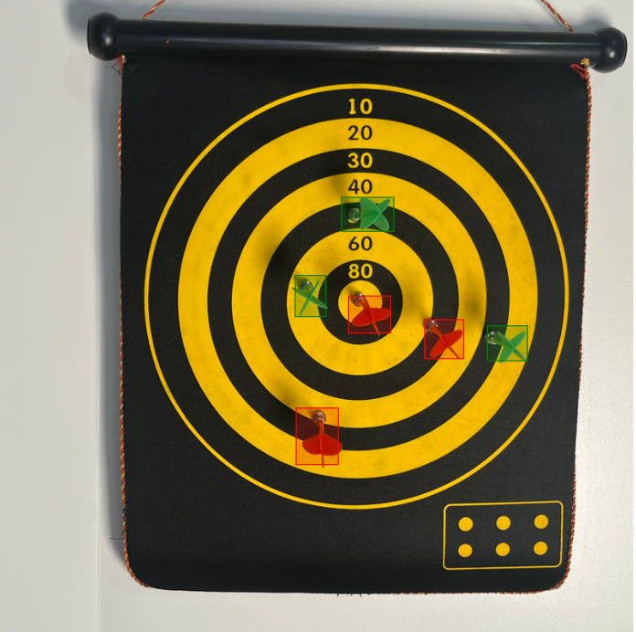
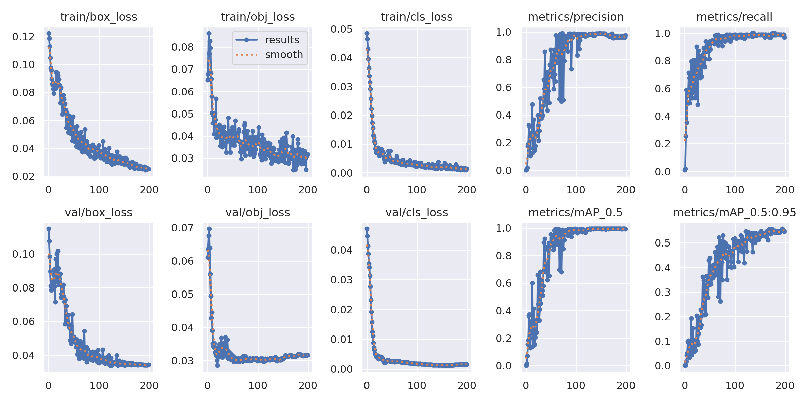
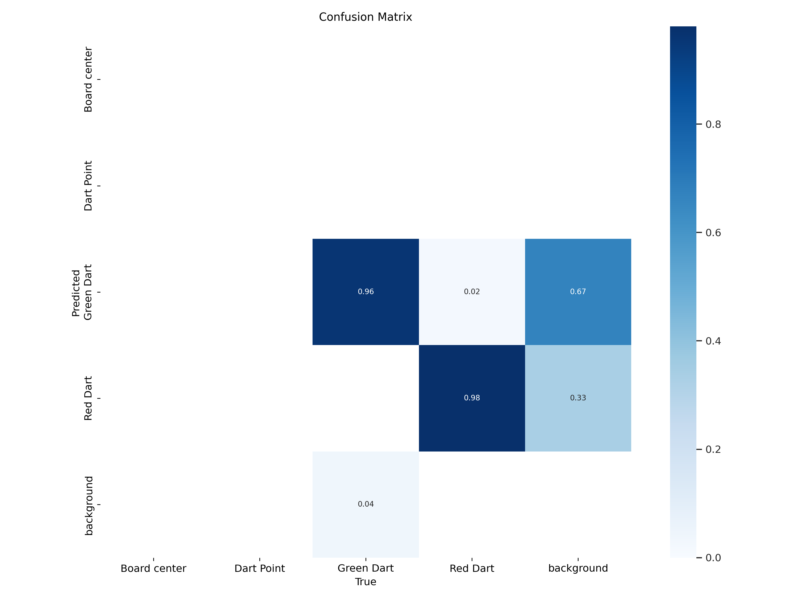
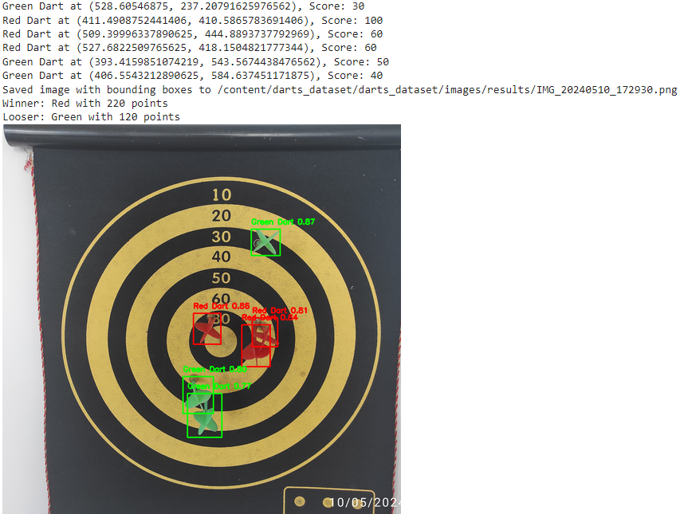
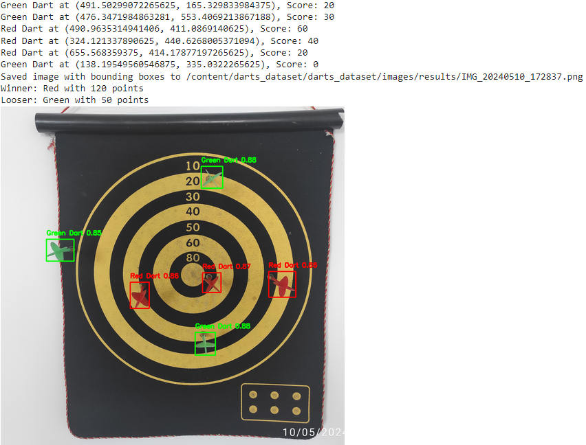
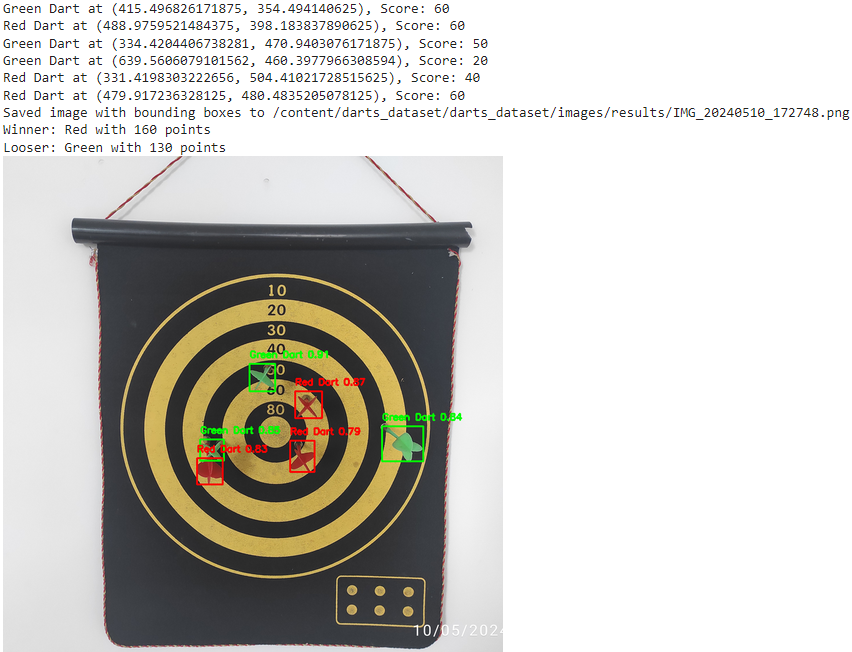

# 2D Computer Vision - Darts Game Analysis

#### Principle of Operation

The goal of the project is to find the score and the winner (red or green) of the darts game with the methods of computer vision. The solution involves several key steps, including data creation and labeling, image preprocessing, object detection using transfer learning, and scoring based on the detected dart positions on the dartboard. Here’s a detailed description of each step:

1. Creation and labeling of the dataset:
    - I took photos of the dartboard with darts from different angles and to create a dataset from 83 images. Then I used the Label Studio to label each dart position on the dartboard, using bounding boxes. These data were exported in the YOLO format.
    Here is an example of the labeled data:
    

2. Image preprocessing:
    - The images were resized to 800x800 pixels. 
    - The dataset was devided on the training and validation sets with test size 0.2. 
    - test data were also resized, cropped and converted too png format.

3. Object detection using YOLOv5:
    - I used the YOLOv5 model for object detection. YOLOv5 is a real-time object detection model that is easy to use and provides high accuracy. For small datasets, YOLOv5 is a good choice because it is fast and requires less computational power compared to other models.
    - I created a yaml file with the dataset configuration and trained the model using the YOLOv5 training script. I used the pre-trained weights of the YOLOv5s model for transfer learning. The model was trained for 200 epochs with a batch size of 16.
    `!python /content/yolov5/train.py --data coco.yaml --batch-size 16 --epochs 200 --data /content/darts_dataset/darts_dataset/darts.yaml --img 800 --weights yolov5s.pt`

    Here is the progress of the training:
    
    

4. Dart board detection:
    - For score calculation, the dartboard needs to be detected in the image. I used the Hough Circle Transform from cv2 library to detect the circle with following criteria:
        . The diameter is bigger that 400 px (half width of the image)
        . The circle is inside the image
        . If there are more than 1 such circles, it choose the biggest one
    - The function returns the center and the radius of the detected circle.

5. Scoring:
    - The scoring is based on the euclidean distance from the center of the dart bounding box to the center of the dartboard (defined previously). The dartboard is divided into 9 scoring zones, each with a different score. The scoring zones are:
        . bullseye: 100 points
        . ring1: 80 points
        . ring2: 60 points
        . ring3: 50 points
        . ring4: 40 points
        . ring5: 30 points
        . ring6: 20 points
        . ring7: 10 points
        . outer: 0 points
    - The `radiuses` were calculated based on the dart board measurements.

6. Evaluation:
    - The best model was used using `torch.hub.load()` function. 
    - The `process_image` function is used to process a single image. It returns the scores for green and red darts and saves the image with bounding boxes to the `result` folder.
    - Each image from test folder is processed and the total scores for green and red darts are calculated. 
    Here is the result of the evaluation:
    
    
    